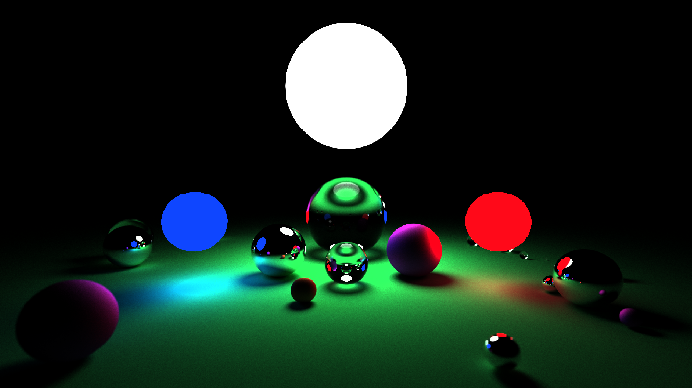

# Simple-RT
Offline CPU path-tracer built entirely in Rust.

# Building
Simply run `cargo build` while in the topmost directory of the repository.

# Usage
Simple-RT is a command line application. It takes 3 command line arguments:

`./SimpleRT samples width height`

Where width and height specify the dimensions of the output image, and samples specifies the number of samples to be taken per pixel.

# Showcase
Example render. Several spheres with different material properties are illuminated by multiple, colored volumetric lights.
Depth of field, diffuse reflection, glossy reflection and color bleed are all shown.
Rendered at 1080p with 9600 samples per pixel.

Other example renders are presented in the example folder.
